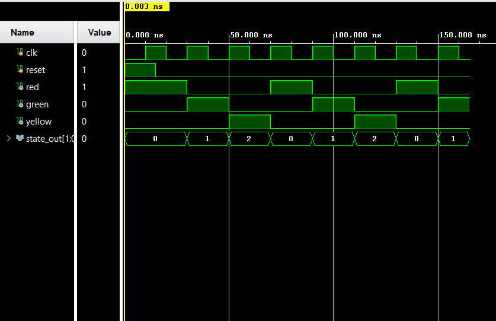

# TRAFFIC-LIGHT-CONTROLLER-FSM

## Overview

This project implements a Traffic Light Controller using Verilog HDL and Finite State Machine (FSM) design principles. The controller cycles through three traffic light states: RED, GREEN, and YELLOW. The design was verified through RTL simulation and waveform analysis.

---

## Features

- FSM-Based Traffic Light Controller
- Three-State Operation
- RED, GREEN, and YELLOW Outputs
- Moore FSM Implementation
- RTL Simulation and Verification

---

## FSM States

| State | Description |
|---------|-------------|
| RED (00) | Red Light ON |
| GREEN (01) | Green Light ON |
| YELLOW (10) | Yellow Light ON |

---

## State Transition Sequence

```text
RED → GREEN → YELLOW → RED
```

The controller continuously cycles through the traffic light sequence.

---

## Inputs

| Signal | Description |
|----------|-------------|
| clk | System Clock |
| reset | Asynchronous Reset |

---

## Outputs

| Signal | Description |
|----------|-------------|
| red | Red Light Output |
| green | Green Light Output |
| yellow | Yellow Light Output |
| state_out | Current FSM State |

---

## Project Structure

```text
TRAFFIC-LIGHT-CONTROLLER-FSM
│
├── RTL Design
│   └── traffic_light_controller.v
│
├── TESTBENCH
│   └── tb_traffic_controller.v
│
├── SIMULATION
│   └── waveform.png
│
└── README.md
```

---

## Simulation Results

The design was verified using a custom Verilog testbench in Vivado Simulator.

### Waveform



---

## Concepts Practiced

- Finite State Machines (FSM)
- Moore Machine Design
- State Encoding
- State Transition Logic
- Sequential Logic Design
- Verilog HDL
- RTL Simulation and Verification

---

## Applications

- Traffic Signal Control Systems
- Embedded Controllers
- Sequential Control Logic
- FSM-Based Digital Systems

---

## Author

**Madhu Visagan H T**


---
